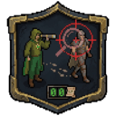
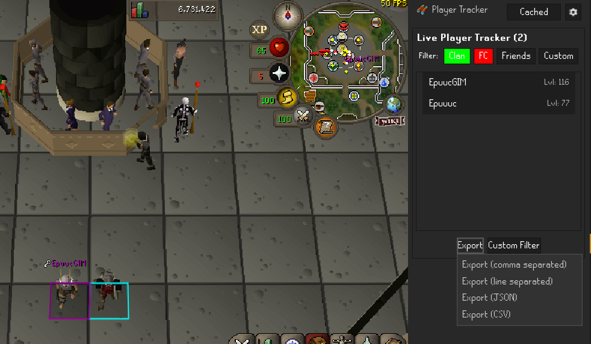
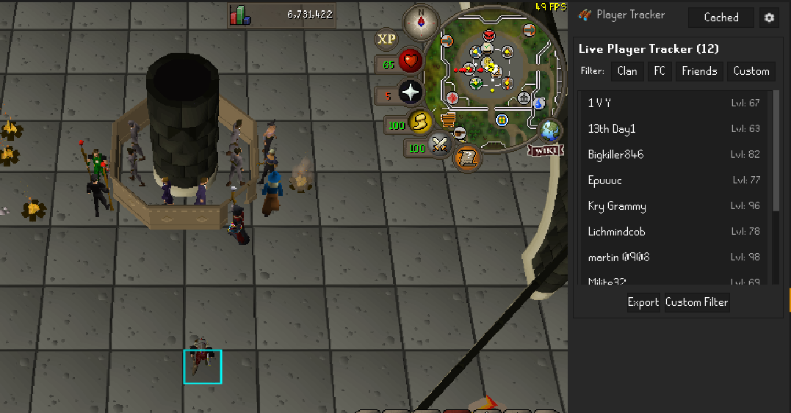
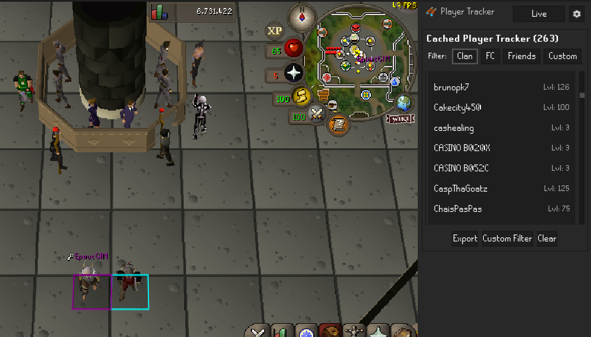

# Player Tracker
<small>The perfect plugin for automatically taking attendance in events or seeing who is around you.</small>

---

The RuneLite Player Tracker is a plugin designed for event hosts who want to easily keep track of who attended an event. This plugin will show you the current players in your area, as well as keep a cached list of everyone you run into. You can filter the lists easily by Clan Members, Friends Chat Members and Friends, as well as a custom list you can configure.

---

## Features
- Displays a list of nearby players by username.
- Displays a list of players you've run into since you logged in.
- Easy export to clipboard in multiple formats (Comma separated and by line).
- Easily filter by Clan Members, Friends Chat Members, Friends, and a Custom list you can configure.
- Set up the cached list in manual mode and add people as you want
- Many more features to come!

## Screenshots

## AI Usage
AI was not used to generate any code except for some boilerplate or example code. This plugin was hand written. The icons were generated because I suck at designing lol. This is my first public repo, but I do a lot of private work and have been coding in numerous languages over many years, before AI became a thing.